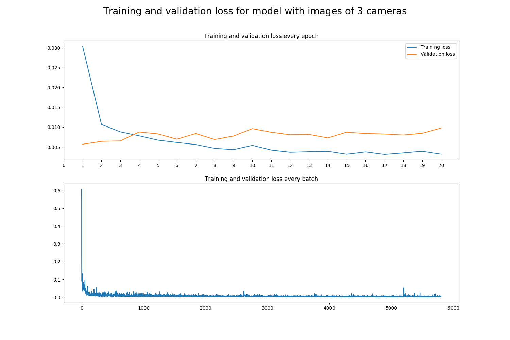

# Self driving car nanodegree

## Project 4: Behavioral cloning

This project consists of a convolutional neural network capable of driving a car by itself on a simulator. 

In order to do that, the neural network receives a picture looking front from the car as an input and gives the angle of turning as output. 

The neural network is programmed and trained in Keras  using data obtained with the Udacity's simulator. Then the saved network is used to drive the car autonomously on the same simulator. 

The programming language used is Python and the libraries used are TensorFlow version 1.3.0, Numpy, OpenCV, and Keras version 2.2.4.

### About the simulator

In order to collect the data needed to train the network, the Udacity's car simulator is used. This simulator records data of a car driven by a human using its "training mode". This data consists on three images taken from the front mirror and the two side mirrors of the car and the steering angle applied by the human. In order to control the car, the keyboard, the mouse or a joystick can be used. The data used to train the models in this project are collected using a joystick since it gives the best stearing angles because of being an analog input instead of a digital input like from a keyboard.

### First model 

#### Training with images of only one camera

As a starting point, the model used for the traffic sign classifier was selected, since it has shown a very high performance detecting street signs. This model was modified to the new problem like this:

- Normalization layer for input from range 0-255 to 0-1
- Convolutional layer with kernel size 5x5, strides 1x1, 10 feature maps as output and Relu activation function.
- Max pooling layer with pool size 2x2 and strides 2x2.
- Convolutional layer with kernel size 4x4, strides 1x1, 18 feature maps as output and Relu activation function.
- Max pooling layer with pool size 2x2 and strides 2x2.
- Convolutional layer with kernel size 3x3, strides 1x1, 30 feature maps as output and Relu activation function.
- Max pooling layer with pool size 2x2 and strides 2x2.
- Flatten operation layer in order to convert output of last max pooling layer into a big array.
- Fully connected layer with 490 outputs, 50% percent of keeping nodes at training time and Relu activation function.
- Fully connected layer with 220 outputs, 50% percent of keeping nodes at training time and Relu activation function.
- Fully connected layer with 43 outputs and Relu activation function.
- Fully connected layer with 1 output and Relu activation function.

This model was trained using the Adam optimizer also used on the traffic sign classifier project, but this time, since this is a regression model instead of a classification model like in the last project, is not the cross entropy what gets minimized, instead it is the mean squared error what gets minimized. The model reached a mean squared error of 0.05.

By using the trained model to drive the car in autonomous mode, it dit really good for the first try, with few data and no data augmentation. It could not make the entire lap though, The car went out of the street on a curve with mud over the street line.  This can be seen in the following video.

#### Training with images of the three cameras

The low loss of the last trained model can indicate that the model was actually overfitting the data. This is logic since the amount of data used for this training was very little (only 3859 images, since only the image of the front mirror camera was used).

The next step in order to improve the performance of the model would be to use the three images

In order to use the lateral images an offset of 15° for the angle measurements corresponding to the left camera is used and an offset of -15° for the angle measurements corresponding to the right camera is used. 

Using these images not only increases the amount of data from 3859 to 11577, it also helps the car to learn how to come back to the street after going out from it.

Using these images actually increased the performance of the model a bit, but at the end the car also went out of the road.

Analysing the training and validation loss, it can be seen that the training loss is lower than 0.0025 after training, but the validation loss is like 0.010 which is 4 times higher than the training loss. This indicates that the model is still overfitting, so data augmentation is needed here.

 

 

