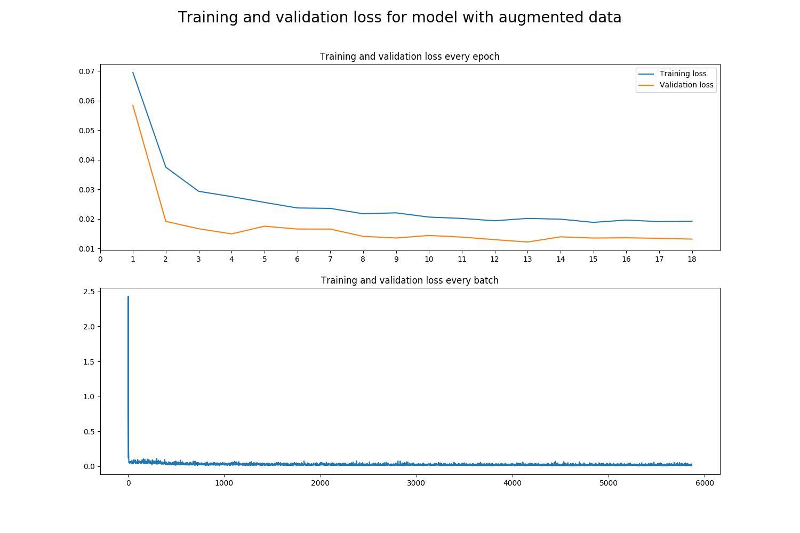

# Self driving car nanodegree

## Project 4: Behavioral cloning

This project consists of a convolutional neural network capable of driving a car by itself on a simulator. 

In order to do that, the neural network receives a picture looking front from the car as an input and gives the angle of turning as output. 

The neural network is programmed and trained in Keras  using data obtained with the Udacity's simulator. Then the saved network is used to drive the car autonomously on the same simulator. 

The programming language used is Python and the libraries used are TensorFlow version 1.3.0, Numpy, OpenCV, and Keras version 2.2.4.

### About the simulator

In order to collect the data needed to train the network, the [Udacity's car simulator ](https://github.com/udacity/self-driving-car-sim) is used. This simulator records data of a car driven by a human using its "training mode". This data consists on three images taken from the front mirror and the two side mirrors of the car and the steering angle applied by the human. In order to control the car, the keyboard, the mouse or a joystick can be used. The data used to train the models in this project are collected using a joystick since it gives the best stearing angles because of being an analog input instead of a digital input like from a keyboard.

### Selected model

#### Training with images of only one camera

As a starting point, the model used for the [traffic sign classifier ](https://github.com/EarendilAvari/SDCND_Traffic_Sign_Classifier) was selected, since it has shown a very high performance detecting street signs. This model was modified to the new task like this:

- Normalization layer for input from range 0-255 to -0.5-0.5
- Convolutional layer with kernel size 5x5, strides 1x1, 10 feature maps as output and Relu activation function.
- Max pooling layer with pool size 2x2 and strides 2x2.
- Convolutional layer with kernel size 4x4, strides 1x1, 18 feature maps as output and Relu activation function.
- Max pooling layer with pool size 2x2 and strides 2x2.
- Convolutional layer with kernel size 3x3, strides 1x1, 30 feature maps as output and Relu activation function.
- Max pooling layer with pool size 2x2 and strides 2x2.
- Flatten operation layer in order to convert output of last max pooling layer into a big array.
- Fully connected layer with 490 outputs, 50% percent of keeping nodes at training time and Relu activation function.
- Fully connected layer with 220 outputs, 50% percent of keeping nodes at training time and Relu activation function.
- Fully connected layer with 43 outputs and Relu activation function.
- Fully connected layer with 1 output and Relu activation function.

This model was trained using the Adam optimizer also used on the traffic sign classifier project, but this time, since this is a regression model instead of a classification model like in the last project, is not the cross entropy what gets minimized, instead it is the [mean squared error ](https://en.wikipedia.org/wiki/Mean_squared_error) between the training stearing angle and the prediction what gets minimized. The model reached a mean squared error of 0.05.

By using the trained model to drive the car in autonomous mode, it dit really good for the first try, with few data and no data augmentation. It could not make the entire lap though, The car went out of the street on a curve with mud over the street line.  This can be seen in the following video.

#### Training with images of the three cameras

The low loss of the last trained model can indicate that the model was actually overfitting the data. This is logic since the amount of data used for this training was very little (only 3859 images, since only the image of the front mirror camera was used).

The next step in order to improve the performance of the model would be to use the three images

In order to use the lateral images an offset of 15° for the angle measurements corresponding to the left camera is used and an offset of -15° for the angle measurements corresponding to the right camera is used. 

Using these images not only increases the amount of data from 3859 to 11577, it also helps the car to learn how to come back to the street after going out from it.

Using these images actually increased the performance of the model a bit, but at the end the car also went out of the road.

Analysing the training and validation loss, it can be seen that the training loss is lower than 0.0025 after training, but the validation loss is like 0.010 which is 4 times higher than the training loss. This indicates that the model is still overfitting, so data augmentation is needed here.

### Data augmentation

#### Fliping images horizontally

In the standard training loop, the car is normally always going straight or to the left, this can result that the car does not learn how to stear to the right because of lacking training data. One way to fight this is to flip the training images horizontally and negate the angle measurement.

By adding horizontally flipped images to the dataset, its size duplicated. And by training the network with this augmented dataset, the training and validation losses stayed almost the same. So this did not really help. Also the performance of the model on the test route was not better.  

#### Using Keras' image data generator

Other option is to use the built in Keras image data generator to create augmented data in training time. For this it is important to deactivate the options "horizontal flip" and "vertical flip" since that can result on bad commands for the neural network. In order to use this method, the function "fit_generator" needs to be used for training instead of "fit".

By using the generator to train the model, it is still not able to drive a lap in the simulator like it can be seen on the next video.

It can be seen though that the training loss increased a lot, staying higher than the validation accuracy which is calculated without data augmentation. This means that the model is not overfitting so strongly anymore. So augmenting the data using this way is a good approach.

Two things can still be improved. One is the model and the other one is the data. 

### New data

Until now, we are training the model with only 11577 images, this is considered a little dataset. The next step in order to improve the performance of the model is to get more data. 

Using the simulator, about 1,5 hours of data were collected, this corresponds to 48651 images. This would still be considered a little dataset, but at least 4 times bigger than the original one. This dataset is also more diverse. It contains:
- Images of the training loop in clockwise direction.
- Images of the training loop in counter clockwise direction.
- Images of the training loop with the car reaching the border of the street and coming back.

Since the performance of the last training was not that bad, being the car capable to drive like 50% of the road, this trained model was used as a base. In other words, the already trained model was trained further using the new data. In order to avoid overfitting since the new data is similar to the first one, early stopping was used, monitoring the changes on the validation loss.

For this, the new script "ModelContTraining.py" was programmed. Contrary to the training script used before, the entire dataset was not loaded directly into the RAM memory before training since the dataset is now way bigger. Instead, a data generator was programmed, which loads batches of data in training time. No augmentation was performed on this data, but the images of the three cameras were used.

Using this approach the car was able to drive 3 laps correctly without going out from the street. On the fourth lap the car went out of the street in the part where the street border cannot be seen.

From the image it can be seen that the validation loss now reached a value of 0.004, which is lower than the validation losses obtained on the last experiments. It is still not a big difference though, Also the training loss stayed lower than the validation loss during most of the training, what is normal, considering that the data was not augmented this time. The training loss reached a value of 0.002. 

The model could still be trained using only data from the part where it goes out of the street so the car is able to run in an infinite loop, but that would require more experimentation and it cannot be assured that it will work.

### Other experiments

It is important to mention that other more complex models were trained and tested for this problem without success. The models where the Inception V3 of Google and the [DAVE-2 of Nvidia](https://images.nvidia.com/content/tegra/automotive/images/2016/solutions/pdf/end-to-end-dl-using-px.pdf) which is the inspiration for this project. This can be explained with the fact that my model has fewer convolutional layers than these other two and the track does not really have complex forms to be recognized in order to need more convolutional layers. An approach with fewer convolutional layers is better since the input to the fully connected layers is closer to the original image than the case when using more convolutional layers.

### Training for a new route

The model is now able to drive a car in the route 1. Now it could be trained for a second route using the last trained model as a base. This new route looks more like a normal street and is way more difficult to drive than the first route since it has more curves and slopes. 

 

